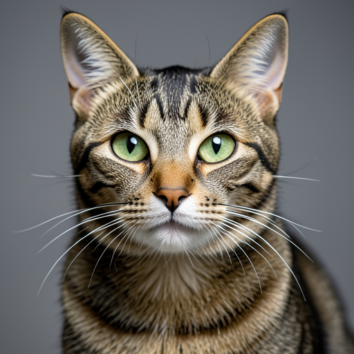
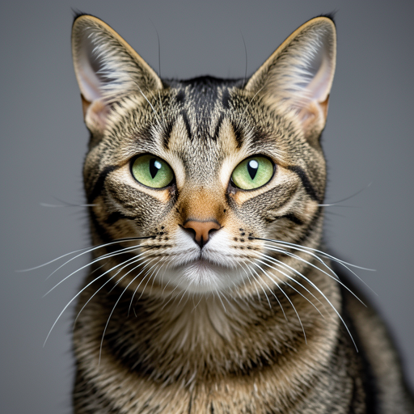
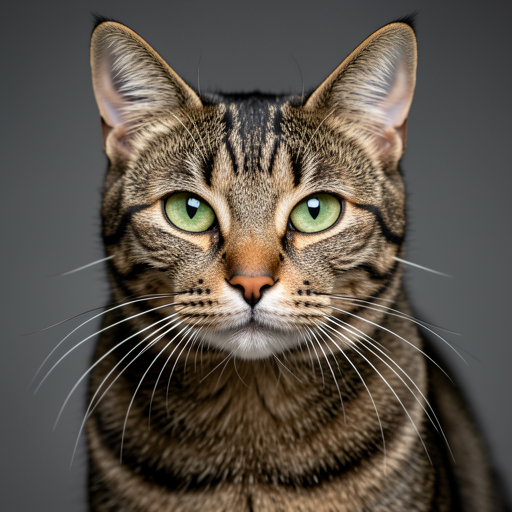
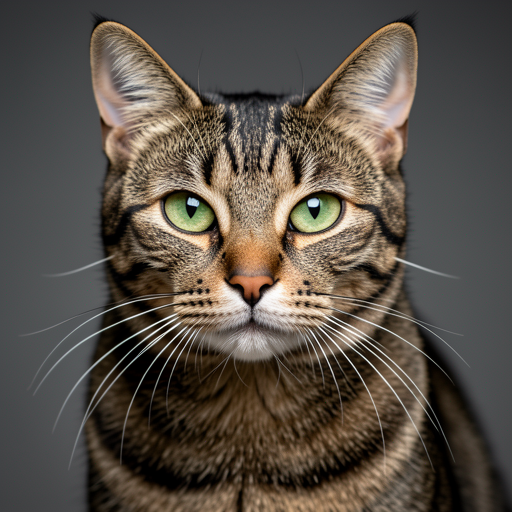
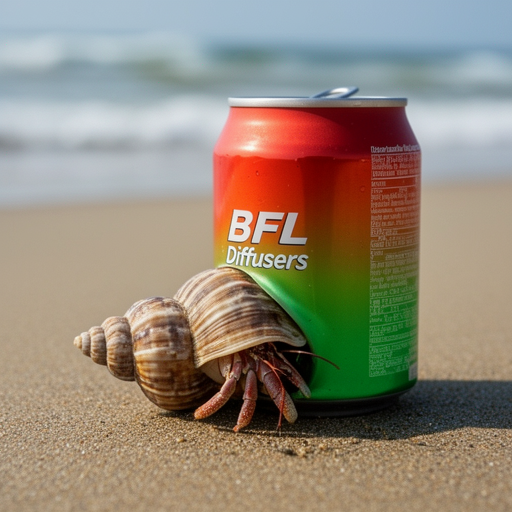
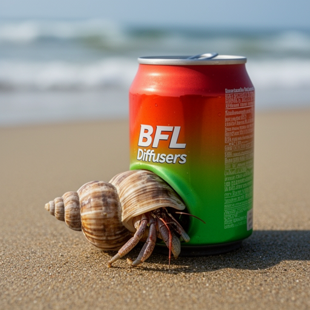
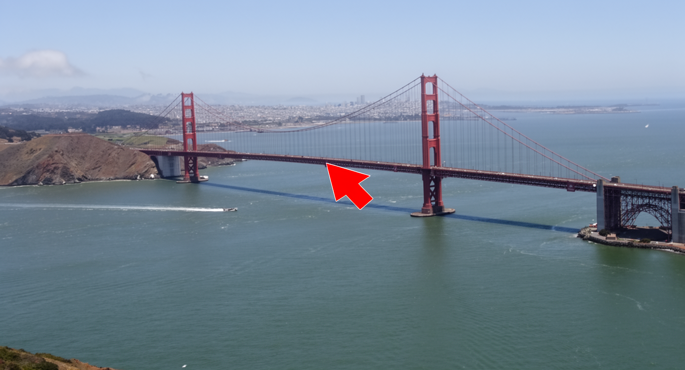

# Flux2 Swift

Swift port of the **FLUX.2** diffusion models using **mlx-swift**.

This repo includes:
- A `Flux2` Swift library
- A `flux2-cli` executable for text-to-image (t2i) and image-to-image editing (i2i).

## Requirements

- Apple Silicon Mac (mlx-swift).
- macOS 14 (Sonoma) or newer.
- **Memory:** FLUX.2-dev is very large; start with the *klein* models if you’re unsure your machine can fit it.

## Install (precompiled CLI)

You can download a precompiled `flux2-cli` from GitHub Releases (macOS arm64 / Apple Silicon):

- Latest: https://github.com/mzbac/flux2.swift/releases/latest

1) Download `flux2-cli.macos.arm64.zip` from a release.
2) Unzip it and run the CLI from the unzipped folder (the executable expects its `.bundle` resources to sit next to it).

```bash
# Or download directly:
# curl -L -o flux2-cli.macos.arm64.zip https://github.com/mzbac/flux2.swift/releases/latest/download/flux2-cli.macos.arm64.zip
#
unzip -o flux2-cli.macos.arm64.zip

# Run in-place:
chmod +x flux2-cli.macos.arm64/flux2-cli
./flux2-cli.macos.arm64/flux2-cli --help
```

## Build

This repo uses Swift Package Manager, but **build/test via `xcodebuild`**.

Build the CLI into `./.build/flux2-cli`:

```bash
./scripts/build-cli.sh
./.build/flux2-cli --help
```

Run tests:

```bash
xcodebuild -scheme Flux2-Package -destination "platform=macOS" test
```

## Model download + cache

`flux2-cli` accepts either a **local snapshot directory** or a **Hugging Face model id** via `--model`:

- Local path: a directory containing `model_index.json` and the expected subfolders (`tokenizer/`, `scheduler/`, `transformer/`, `text_encoder/`, `vae/`).
- Model id: `org/repo` (optionally `org/repo:revision`).

Weights are resolved via `swift-transformers` and cached in the standard Hugging Face hub cache:

- `HF_HUB_CACHE`, or
- `HF_HOME` + `/hub`, or
- default: `~/.cache/huggingface/hub`

Authentication uses the usual Hugging Face sources (e.g. `hf auth login`, `HF_TOKEN`, `HUGGINGFACE_HUB_TOKEN`).

## CLI

### `generate` (t2i + i2i)

The commands below assume you installed the precompiled release artifact and have `./flux2-cli.macos.arm64/flux2-cli`. If you built from source, replace that path with `./.build/flux2-cli`.

Klein models are distilled; step-wise distilled models ignore CFG > 1 (the CLI will warn).

Output format is inferred from `--output` extension (`.png`, `.jpg`, `.jpeg`). If you omit an extension, `.png` is appended.

#### FLUX.2-klein-4B (t2i)

```bash
./flux2-cli.macos.arm64/flux2-cli generate \
  --model black-forest-labs/FLUX.2-klein-4B \
  --prompt "A studio photo of a tabby cat with green eyes, ultra realistic, shallow depth of field" \
  --guidance-scale 1.0 \
  --seed 42 \
  --steps 4 \
  --output temp/klein4b_t2i.png
```

#### FLUX.2-klein-4B (i2i)

```bash
./flux2-cli.macos.arm64/flux2-cli generate \
  --model black-forest-labs/FLUX.2-klein-4B \
  --prompt "Put black sunglasses on the cat, realistic photo" \
  --image "https://huggingface.co/spaces/zerogpu-aoti/FLUX.1-Kontext-Dev-fp8-dynamic/resolve/main/cat.png" \
  --guidance-scale 1.0 \
  --seed 42 \
  --steps 4 \
  --output temp/klein4b_i2i_cat.png
```

#### FLUX.2-klein-9B (i2i)

```bash
./flux2-cli.macos.arm64/flux2-cli generate \
  --model black-forest-labs/FLUX.2-klein-9B \
  --prompt "Put black sunglasses on the cat, realistic photo" \
  --image "https://huggingface.co/spaces/zerogpu-aoti/FLUX.1-Kontext-Dev-fp8-dynamic/resolve/main/cat.png" \
  --seed 42 \
  --guidance-scale 1.0 \
  --steps 4 \
  --output temp/klein9b_i2i_cat.png
```

#### FLUX.2-dev (t2i, 50 steps)

```bash
./flux2-cli.macos.arm64/flux2-cli generate \
  --model black-forest-labs/FLUX.2-dev \
  --seed 42 \
  --steps 50 \
  --guidance-scale 4 \
  --prompt "Realistic macro photograph of a hermit crab using a soda can as its shell, partially emerging from the can, captured with sharp detail and natural colors, on a sunlit beach with soft shadows and a shallow depth of field, with blurred ocean waves in the background. The can has the text \`BFL Diffusers\` on it and it has a color gradient that start with #FF5733 at the top and transitions to #33FF57 at the bottom." \
  --output temp/dev_t2i.png
```

#### FLUX.2-dev (i2i + local prompt upsampling)

This reproduces the “prompt upsampling” workflow from the upstream FLUX.2 docs by expanding the prompt with the local vision-language model (Pixtral-style) before generation.

```bash
./flux2-cli.macos.arm64/flux2-cli generate \
  --model black-forest-labs/FLUX.2-dev \
  --seed 42 \
  --steps 50 \
  --guidance-scale 4 \
  --prompt "Describe what the red arrow is seeing" \
  --upsample-prompt local \
  --print-upsampled-prompt \
  --image "https://raw.githubusercontent.com/black-forest-labs/flux2/main/assets/i2i_upsample_input.png" \
  --output temp/dev_i2i_upsample.png
```

## Examples

The `examples/` folder contains a few straight-from-the-CLI renders to showcase current fidelity (including 8bit quantized model created by `flux2-cli quantize`):

| Model | Mode | Prompt | Reference image | Output |
| --- | --- | --- | --- | --- |
| FLUX.2-klein-4B | t2i | A studio photo of a tabby cat with green eyes, ultra realistic… | — |  |
| FLUX.2-klein-4B | i2i | Put black sunglasses on the cat, realistic photo |  |  |
| FLUX.2-klein-4B (q8_64) | t2i | A studio photo of a tabby cat with green eyes, ultra realistic… | — |  |
| FLUX.2-klein-4B (q8_64) | i2i | Put black sunglasses on the cat, realistic photo |  |  |
| FLUX.2-klein-9B | t2i | A studio photo of a tabby cat with green eyes, ultra realistic… | — |  |
| FLUX.2-klein-9B | i2i | Put black sunglasses on the cat, realistic photo |  |  |
| FLUX.2-klein-9B (q8_64) | t2i | A studio photo of a tabby cat with green eyes, ultra realistic… | — |  |
| FLUX.2-klein-9B (q8_64) | i2i | Put black sunglasses on the cat, realistic photo |  |  |
| FLUX.2-dev | t2i | Realistic macro photograph of a hermit crab using a soda can as its shell… | — |  |
| FLUX.2-dev | i2i | Put black sunglasses on the cat, realistic photo |  |  |
| FLUX.2-dev (q8_64) | t2i | Realistic macro photograph of a hermit crab using a soda can as its shell… | — |  |
| FLUX.2-dev (q8_64) | i2i | Put black sunglasses on the cat, realistic photo |  |  |
| FLUX.2-dev (prompt upsampling) | i2i | Describe what the red arrow is seeing |  |  |

Feel free to reference these prompts to validate your environment; recreating them should produce similar compositions within minor stochastic differences.

## Acknowledgements

- **mlx-swift** (Apple MLX): https://github.com/ml-explore/mlx-swift
- **swift-transformers** (HF): https://github.com/huggingface/swift-transformers
- **diffusers** reference implementation: https://github.com/huggingface/diffusers
- **flux2.c** (for performance optimization): https://github.com/antirez/flux2.c

## License

Apache-2.0. See `LICENSE`.
